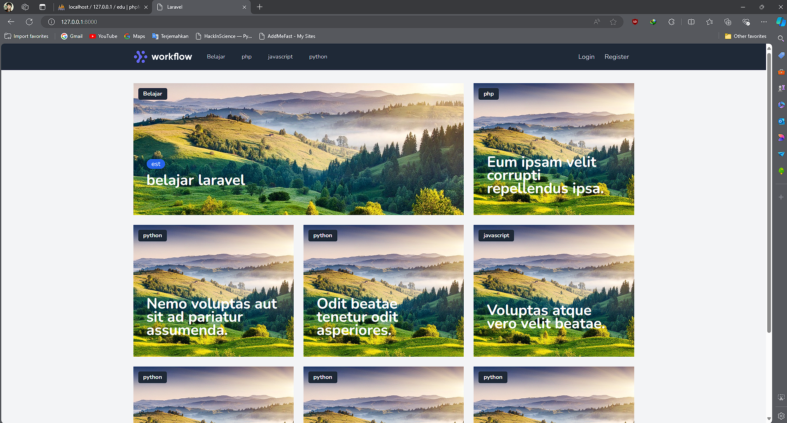

# Website Edukasi Laravel

## Situs : laraveledu.free.nf

Proyek ini adalah sebuah website edukasi yang dibangun menggunakan Laravel. Platform ini memungkinkan pengguna untuk mendaftar, login, dan mengakses berbagai materi edukasi, termasuk artikel dan konten multimedia. Pengguna juga dapat berpartisipasi dalam diskusi terkait materi edukasi.

## Fitur

- **Registrasi dan Login Pengguna**: Pengguna dapat mendaftar dan login ke platform.
- **Materi Edukasi**: Pengguna dapat mengakses dan menjelajahi berbagai materi edukasi yang dikategorikan berdasarkan topik seperti Laravel, PHP, Python, dan JavaScript.
- **Desain Responsif**: Aplikasi ini sepenuhnya responsif dan berfungsi dengan baik di semua perangkat.
- **Forum Diskusi**: Pengguna yang terdaftar dapat berpartisipasi dalam diskusi untuk setiap materi edukasi.
- **Upload Konten**: Pengguna dapat mengunggah materi edukasi yang akan dipublikasikan setelah disetujui oleh admin.

## Tangkapan Layar

### Halaman Utama



### Halaman Login


### Halaman Register


### Halaman Panel


## Instalasi

1. Clone repository ini:
   ```bash
   git clone https://github.com/davlix/laravel-edu
   ```
2. Masuk ke direktori proyek:
   ```bash
   cd laravel-edu
   ```
3. Instal dependensi:
   ```bash
   composer install
   npm install
   ```
4. Salin file `.env.example` menjadi `.env`:
   ```bash
   cp .env.example .env
   ```
5. Generate key aplikasi:
   ```bash
   php artisan key:generate
   ```
6. Atur database di file `.env` Anda, kemudian jalankan migrasi:
   ```bash
   php artisan migrate
   ```
7. Mulai server pengembangan:
   ```bash
   php artisan serve
   ```

## Penggunaan

- Buka `http://127.0.0.1:8000` untuk mengakses website.
- Daftar akun baru atau login dengan akun yang sudah ada.
- Jelajahi materi edukasi, berpartisipasi dalam diskusi, dan unggah konten baru jika Anda adalah pengguna yang berwenang.

